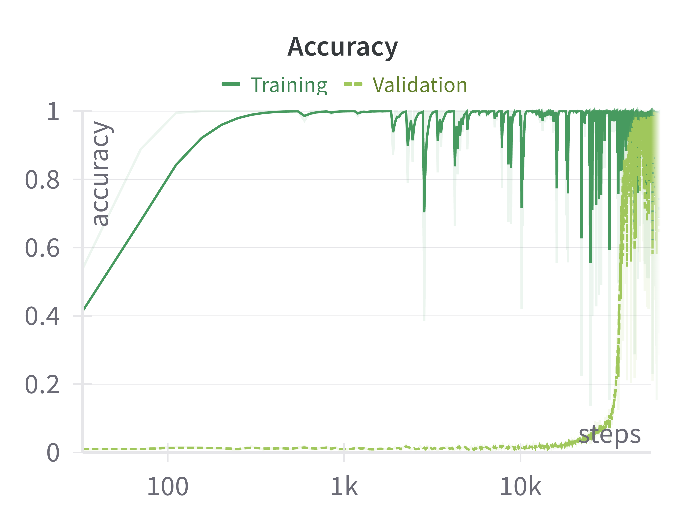
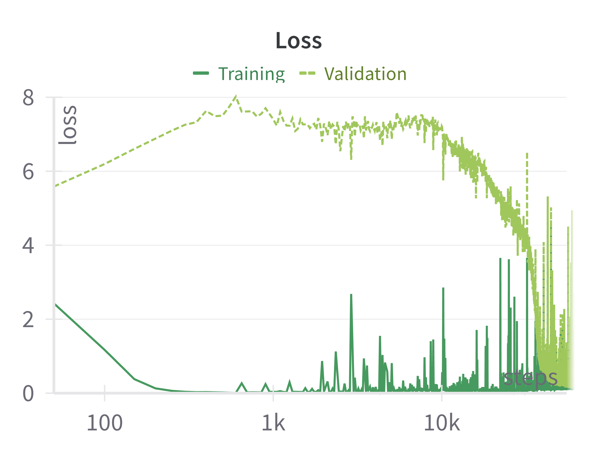
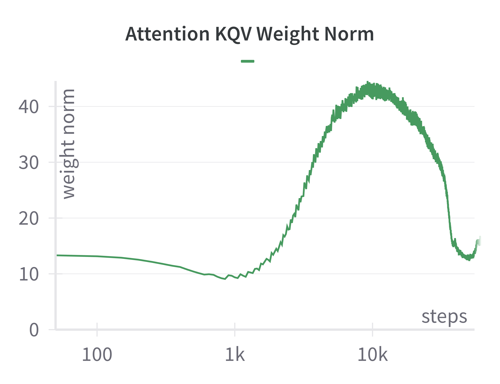
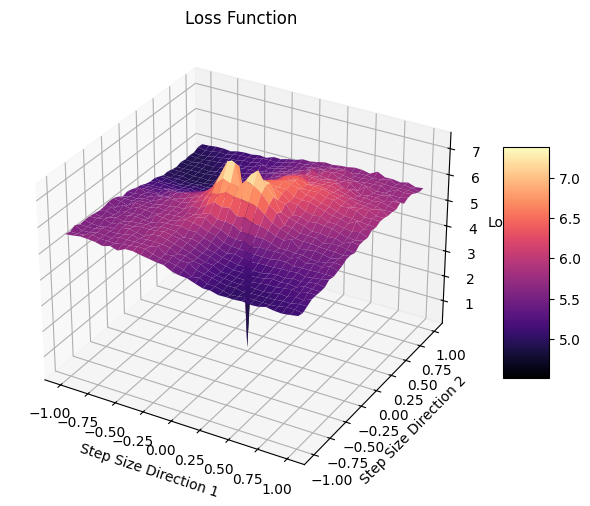

# Grokking

Grokking is the delayed generalization phenomena observed when training a small dataset with a overparametarized model. It was first introduced with by [OpenAI grokking paper](https://arxiv.org/abs/2201.02177). We reproduced grokking by training a Transformer model on small algorithmic dataset and by training a MLP model on MNIST dataset. In this project, we experimented with different configurations and explained the variation in grokking delays. Our key findings are as follows-
* Training data size and batch size are key factors for determining grokking delays. 
* The loss function surrounding a grokking optima tend to have more uneven surface compared to a non-grokking optima. 
* The change in weight norm during training can be a key indicator of deciding whether a model is going to generalize or not. 

## Running

**Dependency Installation**

```sh
pip install -r requirements.txt
```

**Run**

```
python3 training.py --training_fraction 0.2 --operation xy/y --device cpu
```

**Loss Contour Plot**<br>
We plotted loss contours following [loss landscape visualization paper](https://papers.nips.cc/paper_files/paper/2018/hash/a41b3bb3e6b050b6c9067c67f663b915-Abstract.html) by stepping into two randomly-generated gradient directions.

First create checkpoints from the model during training. 
```
python3 training.py --training_fraction 0.2 --operation xy/y --ckpt_interval 1000 --save_checkpoint True
```

Then, in `training.py`, add `plot_loss_acc_contours()` and run

```sh
python3 training.py --init_from load --ckpt_name 'xy|y_f0.2_p97_b512_st50000_2024-05-13-11-39-39' --seed 60
```

# Results

<div style="display: flex; gap: 10px;">  
    
    
</div>

<div style="display: flex; gap: 10px;">  
    
    
</div>


## References

1. Alethea Power, Yuri Burda, Harri Edwards, Igor Babuschkin, & Vedant Misra. (2022). Grokking: Generalization Beyond Overfitting on Small Algorithmic Datasets.
2. Ziming Liu, Ouail Kitouni, Niklas Nolte, Eric J. Michaud, Max Tegmark, & Mike Williams. (2022). Towards Understanding Grokking: An Effective Theory of Representation Learning.
3. Ziming Liu, Eric J. Michaud, & Max Tegmark. (2023). Omnigrok: Grokking Beyond Algorithmic Data.
4. Hao Li et al. Visualizing the loss landscape of neural nets. Advances in neural information processing systems 31 (2018). 